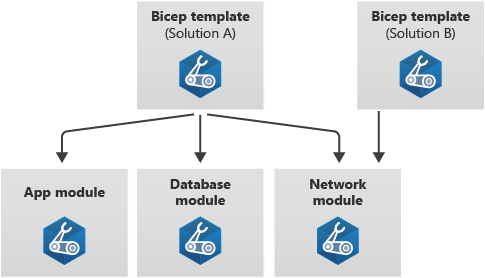

# Why we need modules?

Imagine you have a Bicep template that deploys application, database, and networking resources for solution A. You might split this template into three modules, each of which is focused on its own set of resources. As a bonus, you can now reuse the modules in other templates for other solutions too. So when you develop a template for solution B, which has similar networking requirements to solution A, you can reuse the network module.

